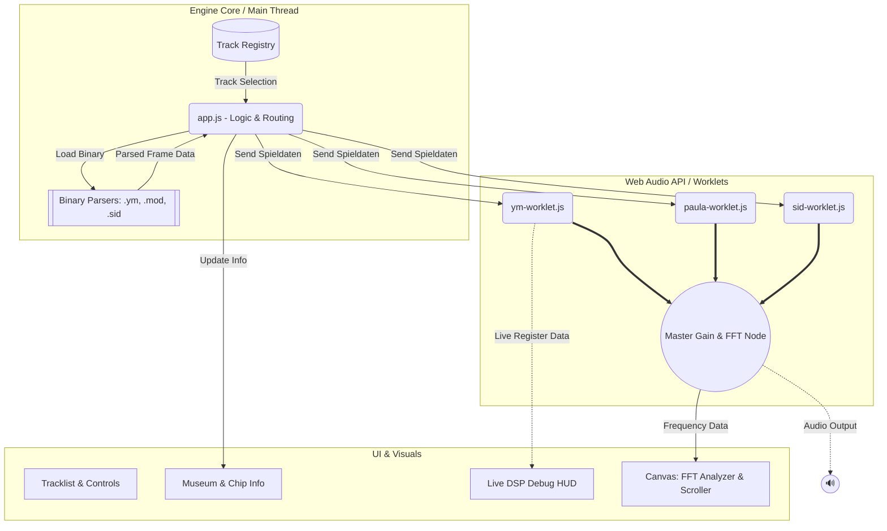

I love the old Chiptunes from C64, Amiga and Atari ST.  
Finally with the help of coding assistants, I'm able too reproduce the feeling from the good old times in pure Javascript.
https://holladavid.github.io/Chiptunes-Fantasy/

***

# 🕹️ Chiptunes-Fantasy

**Welcome to the ultimate HTML5/JavaScript demoscene music disk.**

*Chiptones-Fantasy* is a passion project built to revive the golden era of 8-bit and 16-bit chiptunes using **pure JavaScript and HTML5** — no heavy frameworks, no bloated libraries, and absolutely no pre-recorded MP3s. Just raw binary parsing, accurate hardware emulation, and pure math running at a rock-solid 50Hz VBLANK.

> **🚧 CURRENT DEVELOPMENT FOCUS:**  
> While the core architecture is built to support the big three (Amiga, C64, Atari), our active deep-dive right now is the **Atari ST (YM2149)**. We are currently perfecting the binary `.ym` parsers, cycle-accurate Digidrum hacks, and hardware envelope (HEG) magic before expanding the Amiga and C64 loaders.

## 🚀 The Vision & Tribute
This project is a love letter to the audio wizards of the 80s and 90s — legends like Jochen Hippel, Rob Hubbard, and Chris Hülsbeck. They didn't just compose music; they hacked the hardware. They abused CPU timers, manipulated pulse widths, and wrote their own drivers to make simple programmable sound generators sound like entire orchestras.
*Chiptunes-Fantasy* makes these genius programming tricks tangible. We don't just play the music; we expose the guts of the hardware in real-time, honoring the artists and educating the nerds.

## 🎛️ Current Features
*   **Atari ST (Yamaha YM2149F):** Cycle-accurate register emulation, including Digidrum timer hacks and Hardware Envelope Generator (HEG) speech synthesis.
*   **Commodore Amiga (MOS Paula 8364):** Real-time PCM DMA sample playback and pitching.
*   **Commodore 64 (MOS SID 6581):** Analog filter and PWM simulation.
*   **Live DSP Debug HUD:** Watch the hardware registers, frequency sparklines, and active hacks update in real-time while the music plays.
*   **Digital Museum:** Read deep technical breakdowns of the sound chips and the specific tricks used by the composers of the active track.

## 🏗️ Architecture
The engine is highly modular. You can easily plug in new hardware simulator cores (e.g., alternative YM-Worklets or entirely new chips like the NES APU) or add new binary parsers.

## 🛠️ How to run locally
Because this project uses `AudioWorklets` and ES6 Modules, browsers block it from running directly via the `file://` protocol due to CORS security policies.

1. Clone the repository.
2. Spin up a local web server (e.g., using the "Live Server" extension in VS Code, or `python -m http.server 8000`).
3. Open `index.html` in your browser.
4. Crank up the volume and let the analog filters burn!

***

**Copying is an act of love. Keep the scene alive.**

---

